# "xGE" keymap for MoErgo Glove80

This is a personalized, Swedish variant of Sunaku's very popular keymap "[Glorious Engrammer][1]" for the [Glove80 keyboard][2].
This keymap is made to be used together with a standard Swedish QWERTY keyboard layout (in your OS settings).

[1]: https://github.com/sunaku/glove80-keymaps
[2]: https://www.moergo.com/

To get an overview of the installation process, customization and general functionality of the keymap, It is recommended that you first familiarize yourself with the keymap on which it is based upon; [Glorious Engrammer][1].

## Release

Download:
- https://github.com/lol2k/glove80-keymaps/releases/latest

Changelog:
- https://github.com/lol2k/glove80-keymaps/releases

## Legend

#### Alpha & Typing
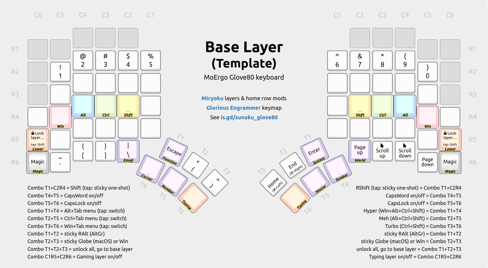
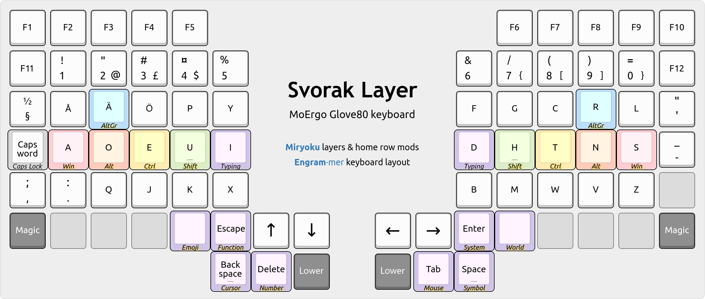
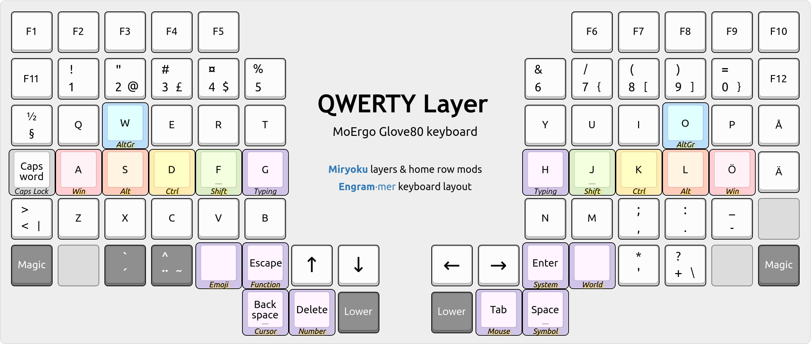
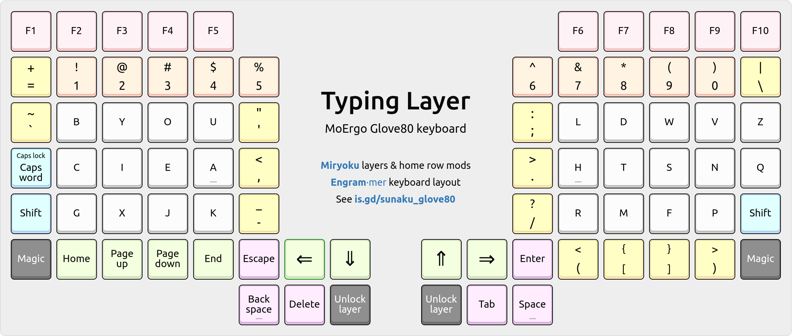
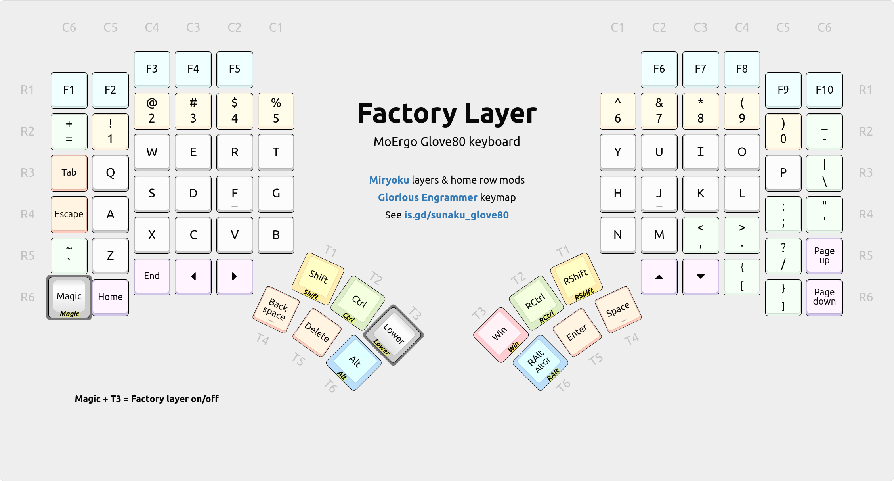
#### Specialized
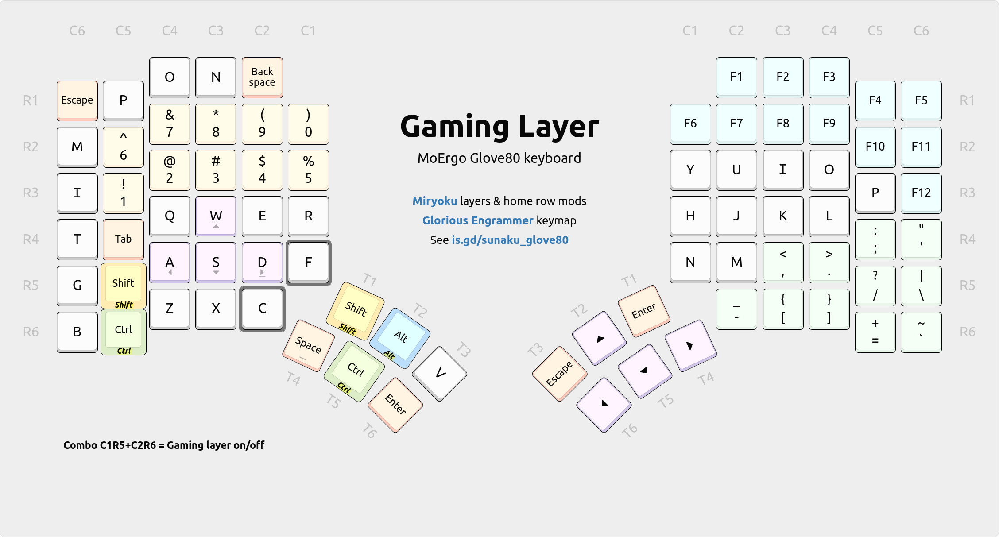
#### Symbols
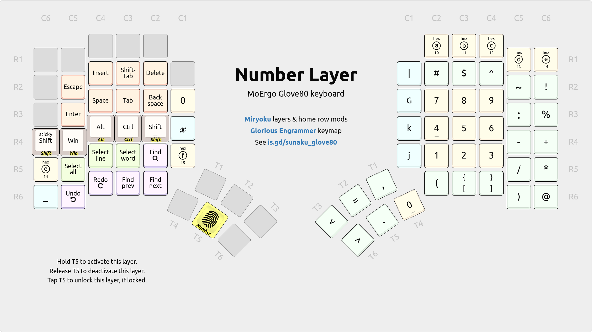
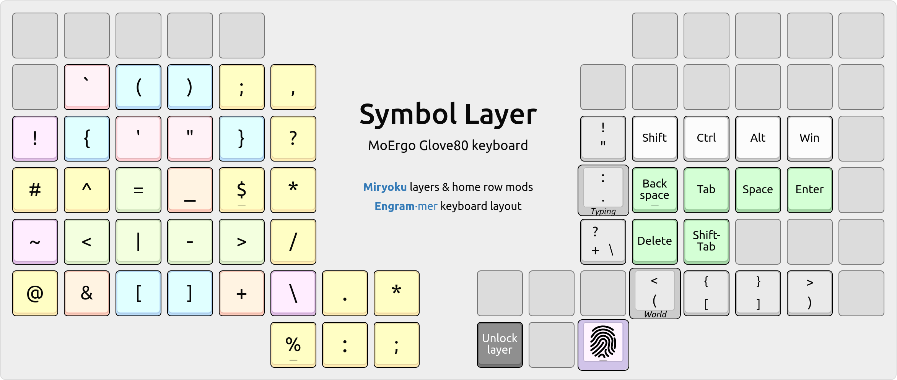
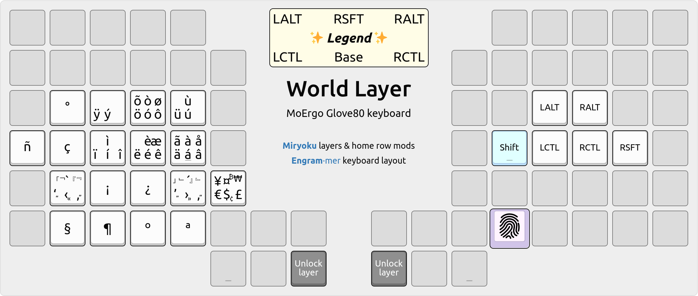
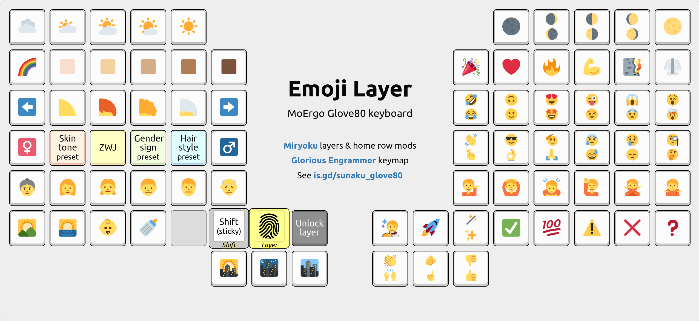
#### Navigation
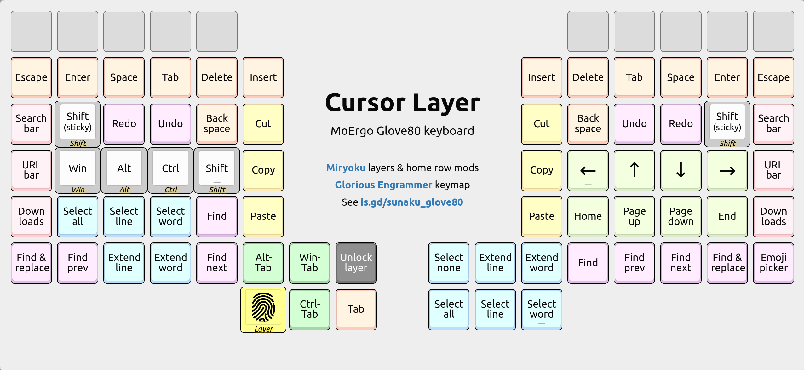
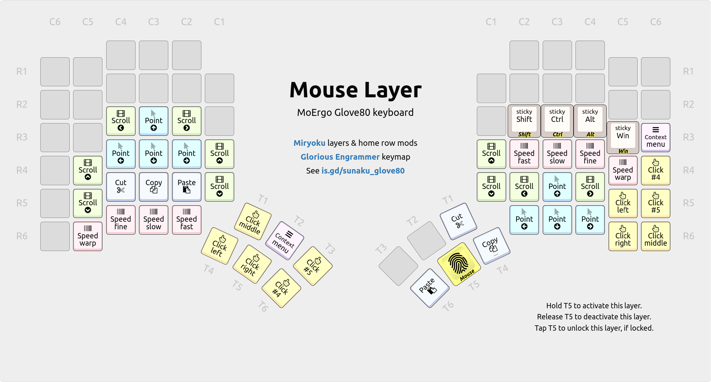
#### System
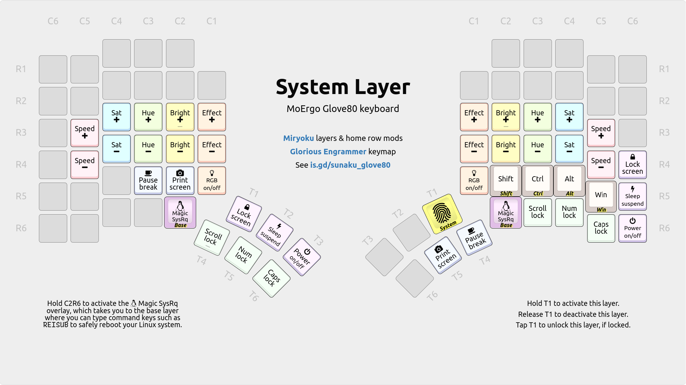
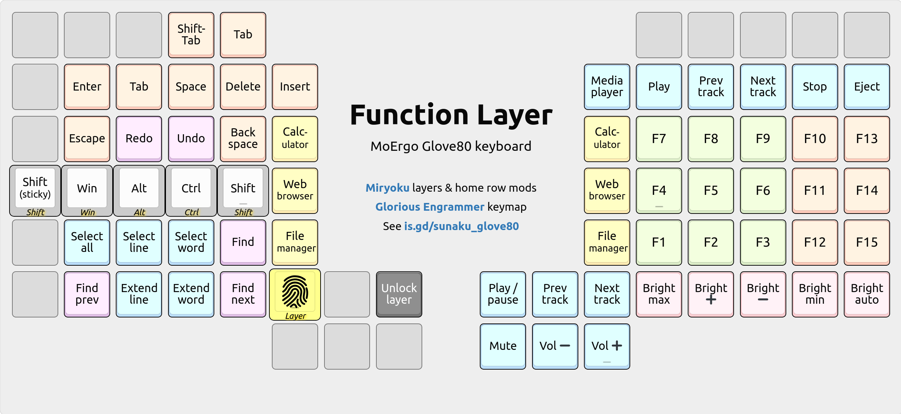
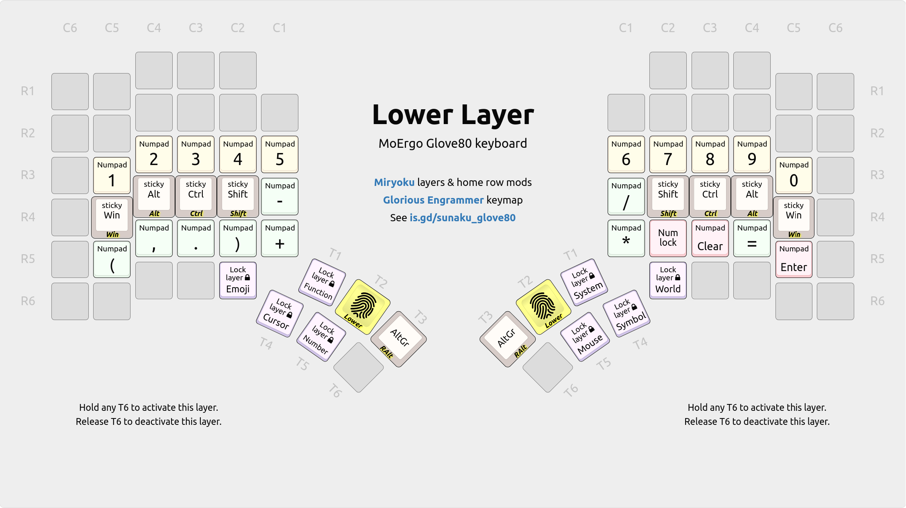
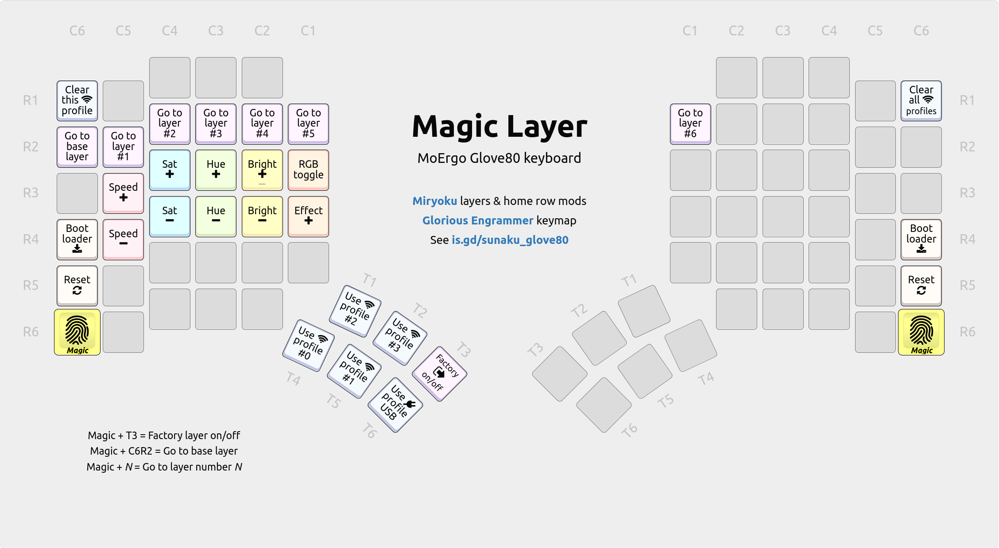
